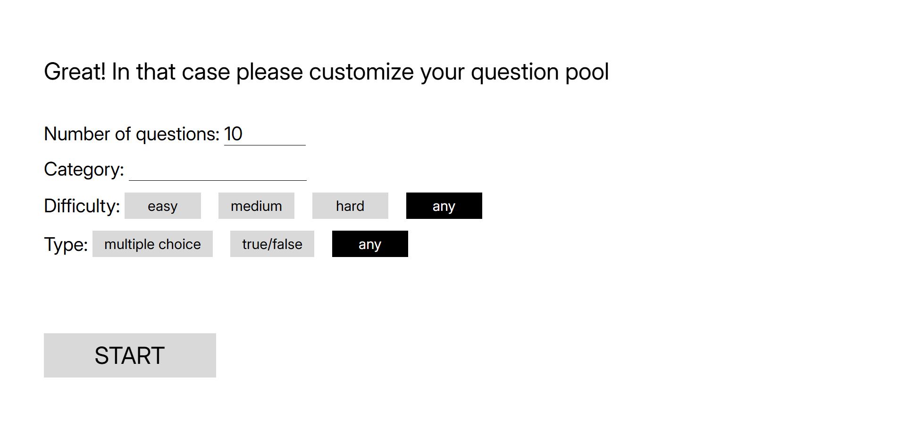
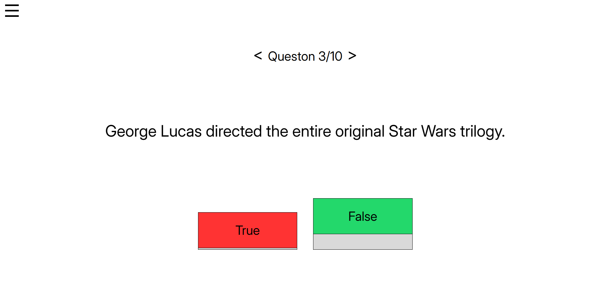
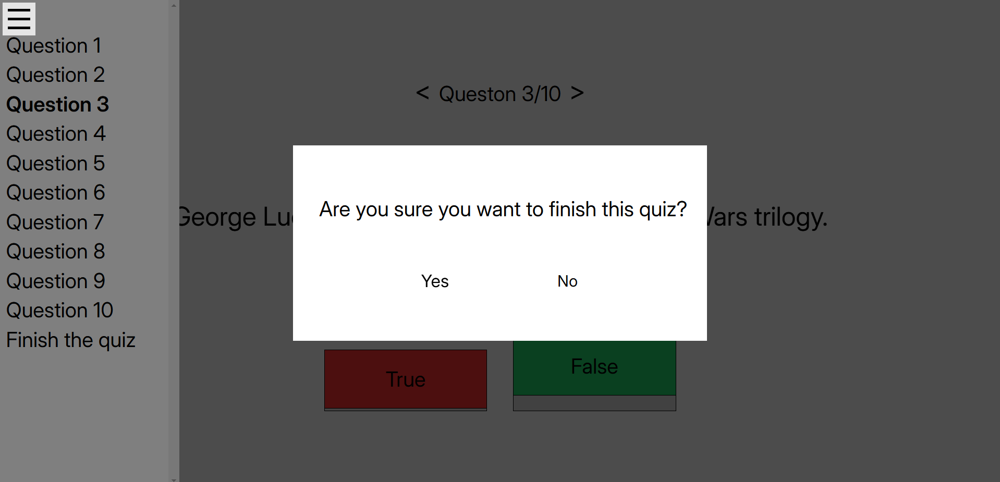
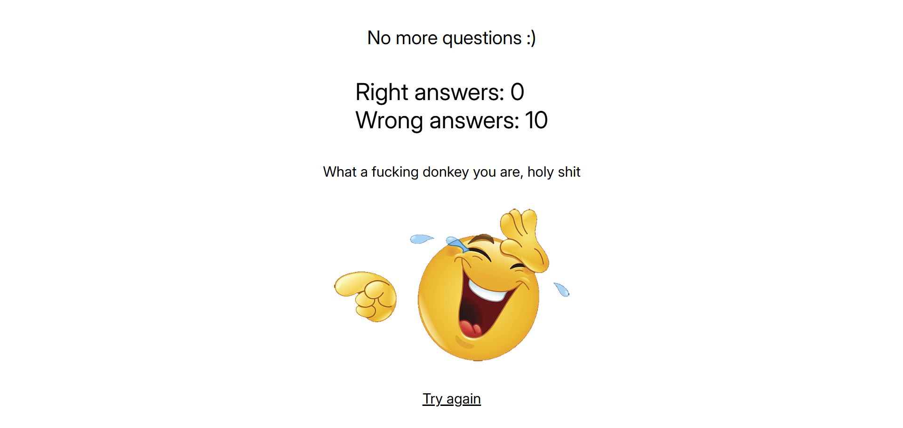

# Trivia Website

React App that lets you test your knowledge in various quizes

## Screenshots





## TODO
- uhhhhhh I don't know

## Changelogs

### version 2
- Animations added!
- Some funnies on results page if you get 0 right answers or too many right answers

### version 1
First version of this app. It works
- Question pool customization page, which includes
  - Category
  - Difficulty
  - Number of questions
  - Type (4 answers or true/false)
- Results page
- Question navigation tab
- Functioning questions page

## How to run it?
Run these commands in your console

```
npm install
npm run dev
```

After that you'll see a message with a localhost link. Just visit this link on your website